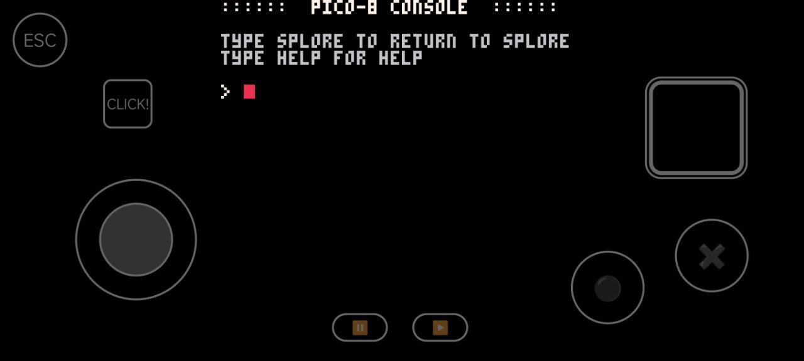

# Winlator input control profile for Pico-8 Console
  
This file made my life easier. ❤  
Pre-configured input mappings for **Pico-8** games running on **Winlator** (Android emulator).
  
## 🎮 Features 
✅ **Full Pico-8 Gamepad Support:**

- **D-Pad**, ⚫ (O),✖ (X) buttons for classic gameplay.
- **ESC Key**: Quick exit from games.
- **Right-Click Button**: For menus or right-click actions.
- **Virtual Trackpad**: Smooth cursor movement (great for hybrid games or UI navigation).

	  

## 📦 How to install?

- Download the [pico-8.icp](https://github.com/DDD66218/pico8-winlator-controls/releases/download/untagged-208951f5822c87d45de8/pico-8.icp) file.

- Open Winlator → Input Controls → Import Profile → Open File → load pico-8.icp. That's it!

